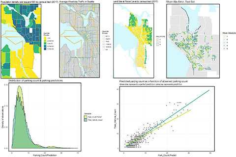

## Portfolio

---

### Spatial Data Analysis 

[(RStudio) Seattle Parking Demand Prediction](/project_markdown/Seattle_parking.html)

---
[(Python) US Domestic Flight Ticket Price Prediction](https://cpln-flight-control.github.io/Airline-Ticket-Price-Prediction/Visualizations)

---
[(RStudio) Time/Space Prediction: Bikeshare Trips in NYC](/project_markdown/NYC_bikeshare.html)

---
[(RStudio & ArcGIS) Megaregion Airport Catchment and Customer Leakage Effect ](/project_markdown/Megaregion_Texas.html)

---
[(RStudio) Geospatial risk modeling: Chicago narcotics crime](/project_markdown/Chicago_drugcrime.html)

---
[(RStudio) San Francisco Housing Price Prediction](/project_markdown/SF_housingprice.html)

---

### Transportation Planning

- [Project 1 Title](http://example.com/)
- [Project 2 Title](http://example.com/)
- [Project 3 Title](http://example.com/)
- [Project 4 Title](http://example.com/)
- [Project 5 Title](http://example.com/)

---

---

Page template forked from <a href="https://github.com/evanca/quick-portfolio">evanca</a>

<!-- Remove above link if you don't want to attibute -->
